# THE MURDER CASTLE

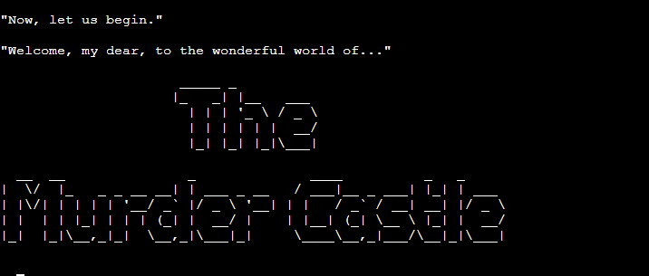

This Python-based text based adventure game is loosely based on the history of H. H Holmes, a serial killer from America that allegedly clamed at least 27 lives in his [Murder Castle](https://www.history.com/topics/crime/murder-castle#section_2). 
I first learned about this case by [The Poisoner's Cabinet podcast](https://www.youtube.com/watch?v=y90seA7T9GU).
I've also taken inspiration from the video game ["The Dark Pictures Anthology: The Devil in Me"](https://en.wikipedia.org/wiki/The_Dark_Pictures_Anthology:_The_Devil_in_Me) by Supermassive Games.

Throughout the game, there are multiple choices leading either to death or survival, and depending on what choices you make along the way, your chance of escaping the Murder Castle increases. Or decreases.

There's also inspiratio taken from the very popular trope "Transported into a novel", where the protagonist wakes up inside a book. This is usally reserved for fantasy and action, so I gave it a bit of a twist.

As a true crime enthusiast, the idea came naturally, and creating all the rooms with this as inspiration was highly enjoyable.

You can find the [deployed version here](https://murder-castle-adventure.herokuapp.com/)
# 

- [UX](#ux)
    - [User goals](#user-goals)
        - [Returning visitor goals](#returning-visitor-goals)
        - [As a website owner](#as-a-website-owner)
- [Flowshart](#flowshart)
- [Designs](#designs)
    - [ASCII](#ascii)
- [Features](#features)
    - [Features left to implement](#features-left-to-implement)
- [Testing](#testing)
    - [Validator testing](#validator-testing)
    - [Manual testing](#manual-testing)
    - [Bugs](#bugs)
- [Deployment](#deployment)
- [Tools](#tools)
- [Credits](#credits)

# UX

## Target audience
- Anyone with an interest in true crime who enjoy gaming

## User goals
- To play and enjoy a text-based game
- Understand how the game works at the start of the game
- Play a game that streamlined and easy to follow along
- Learn a touch of history about a famous serial killer

## Returning visitor goals:
- Being able to replay the game with different outcomes

## As a website owner:
- I want to create a story that's fun to read 
- I want to create a fun game with different endings and options to choose from
- I want to be able to easily add more rooms to the game to keep it updated

# Flowchart
The outline of the game was made with the help of [Ludichart](https://www.lucidchart.com/pages/)

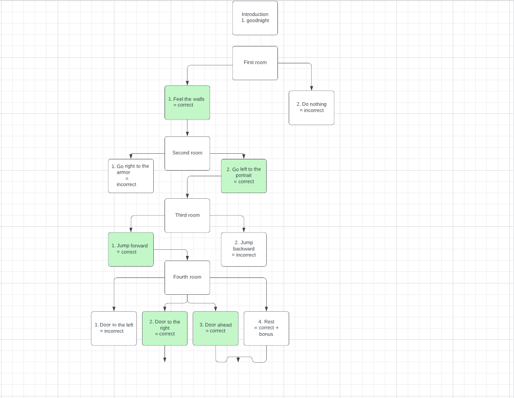
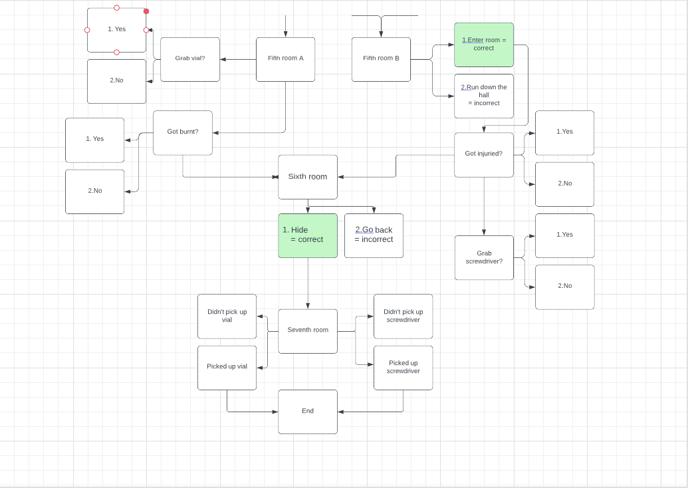

# Design

The design in regard for a text based game I'm interpreting as both ASCII art, the text layout, as well as the mood.

My hopes when writing the game is provide an interesting story, so I've tried to supply the player with text in a speed that's not too rushed but simultaniously not boring, so the tension of the game isn't lost.
The text is provided in small chunks not to make the terminal messy and to allow the player to read more easily. I've added terminal clearing where I found suitable and with the help of a friend to make the text sections less confusing.

For the mood of the game I wanted to add both mystery with a touch of humor. The game is challenging in that it's easy to die, so I added named titles to every type of death (and win) to offer a bit of fun. 

# Features

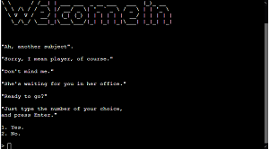
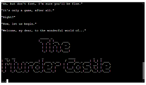
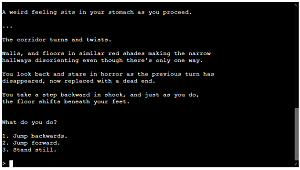
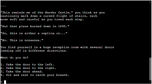
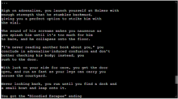
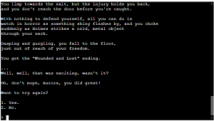

- The app is built with a total of 8 different rooms.
- Each room presents different options for where to proceed, some sending the player to another room and other to the players death.
- There's room 1-4 then 5a and 5b depending on where the player chooses to go from room 4, followed by room 6 and 7.
- How the game ends depends entirely on the players choices throughout the game.
- Each different death and win has its own titled ending.

# Features Left To Implement

- Create a function that stores each ending the player have gotten, so that they can "collect" endings and get everyone, and adding a special price for getting every ending.
- Add more ASCII art to the rooms to give them more personality

# Testing

## Validator testing

Code validation done via [PEP8](https://pep8ci.herokuapp.com/)

The following errors have been corrected:
- Lines too long
- Missing blank lines between functions
- Trailing white space
- Expected two lines between functions but only found one

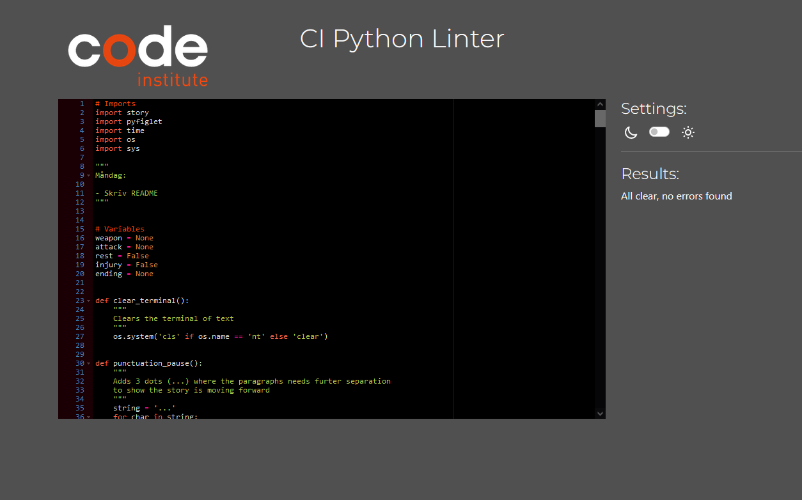
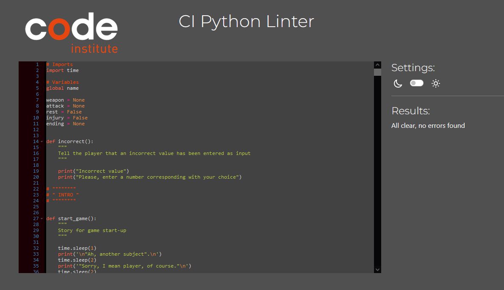

## Lighthouse

Lighthouse report done via Google Chrome Devtools.
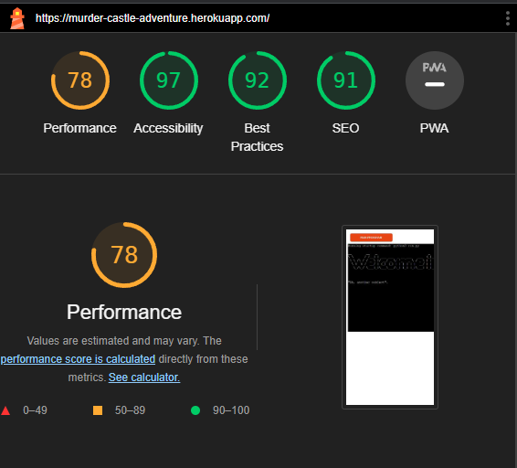

## Manual Testing

I have manually tested the game by:
- Entering incorrect input to ensure the app doesn't crash
- Played through the game for all different endings and ensured they are correctly aligned
- Had a friend play through the game to have a fresh set of eyes

| Action        | Expected Behavior     | Actual Behavior |
|--------------|:-----------:|------------:|
| Load the game | The intro page shows up and renders fully | Pass  |
| Name input | Enters name and throws an error when the name includes an integer, and the name is the same throughout the game. The name also remains when replaying the game instead of restarting | Pass  |
| Choose different options to reach different areas | Each choice leads to a different room or ending, not throwing any errors or leading to the same ending or room | Pass |
| Choose rest | When chosing to rest in room four, the rest buff remains with the player throughout the game and affects the ending | Pass |
| Choose a weapon | When the player chooses a weapon, it remains with the player throughout the game and affects the ending | Pass |
| Losing the game | When losing, the player will get a custom ending depending on how the game was lost and then given the option to restart the game | Pass |
| Restarting the game | When restarting, the rest and weapon variables reset so the player can pick new choices, the player also restarts the game from Room One rather than from the intro screen | Pass
| Quit the game | When quitting the game, the player will be sent back to the start | Pass

# Bugs

## Fixed bugs

Throughout building the app I had several bugs regarding linking together rooms and not getting confused by which story section belongs where.
This was a continuous process of handling while building the app.

Same thing went for different endings depending on what choices the user did, so to puzzle everything together and not get the incorrect ending or outcome and ensure that each buff got activated where it was supposed to and that it sticks throughout the game.

While testing, it was discovered that the buffs remained when restarting the game because the restart_game function didn't include a way to reset them. This was fixed by giving the weapon and rest variables "None" in the restart_game function, and the issue was solved.

## Deployment

This project was deployed via GitHub Pages and Heroku used as a development environment. From GitHub, I could commit and push my changes throughout the project that automatically got added to the project linked in Heroku.

## Github

Steps I took to deploy my website;

- Go to the repository for  Portfolio-project-2
- Click the Settings tab and locate the Pages tab
- Select to deploy from main branch
- A few minutes later, upon refreshing the page, my site was live

For anyone wishing to Fork this repository, then do as follows;

- Log in to GitHub and find your way to the GitHub repository you want, in this case, my [portfolio project 3](https://github.com/AuroraStorm-sw/Portfolio-project-3)
- Up in the right corner of the repository page, on the row of buttons just beneath the user icon, you'll find the "Fork" button.
- Click the "Fork" button, and you will now have created a copy of the repository to your GitHub account.

To clone this repository, then do as follows;

- Log in to GitHub and find your way to the GitHub repository you want, in this case, my [portfolio project 3](https://github.com/AuroraStorm-sw/Portfolio-project-3)
- Click the "<> Code" button in the upper right above the files
- Copy the link
- Open Gitpod and from there, select which directory you want the clone to be created into.
- Type in "git clone" in your Gitpod terminal and paste the link copied from GitHub, and the close will be created.

## Deploying the app in Heroku:
This was done with the help of instructions from Code Institute, and goes as follows;

- Log in to Heroku or create a new account
- On the main page up near the top, click "New" and select "Create new app"
- Pick your unique app name and select your region
- Click the "Create App" button
- On the next page, manover to the "Settings" tab and find "Config Vars"
- Click "Reveal Config Vars" and add "Port" to key and "8000" to value, then click "Add"

# Tools and programs
- [Python](https://en.wikipedia.org/wiki/Python_(programming_language))
- [GitHub](https://github.com/)
- [Gitpod](https://gitpod.io/)
- [Heroku](https://gitpod.io/)
- [Lucidchart](https://www.lucidchart.com/)
- [PEP8](https://pep8ci.herokuapp.com/)

## Modules
- [time](https://docs.python.org/3/library/time.html#time.sleep)
- [os](https://docs.python.org/3/library/os.html?highlight=os#module-os)
- [sys](https://docs.python.org/3/library/sys.html?highlight=sys#module-sys)
- [pyfiglet](https://www.geeksforgeeks.org/python-ascii-art-using-pyfiglet-module/)

 # Credits

- How to clear the terminal for the "clear_terminal" function: (Stackoverflow)[https://stackoverflow.com/questions/2084508/clear-terminal-in-python]
- How to write out one character at a time for the "punctuation_pause" function: (Stackoverflow)[https://stackoverflow.com/questions/9246076/how-to-print-one-character-at-a-time-on-one-line]
- How to check if a user input is a string for entering their name: (Stackoverflow)[https://stackoverflow.com/questions/48054241/how-to-check-if-user-input-is-a-string]
- How to use ASCII art: (GeeksForGeeks)[https://www.geeksforgeeks.org/python-ascii-art-using-pyfiglet-module/]

## Inspiration
Inspiration for how to build my game has been drawn from many different students on Code Institute by looking at their submitted projects and projects up for review. Examples of inspiration comes from [miriampayne](https://github.com/miriampayne/walkers-text-adventure), [wallacezone](https://github.com/wallacezone/little-dungeon/blob/master/little-dungeon.py), and [JamesFahey](https://github.com/JamesFahey/zombie-survival).

Throughout the project, I've searched for answers for minor and major issues on [Stackoverflow](https://stackoverflow.com/)